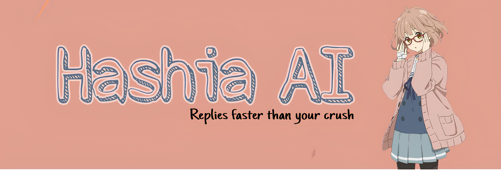

# Hashia AI

A Facebook Messenger chatbot powered by Google's Gemini AI that can handle text conversations, analyze images, and fetch Pinterest images.

## Features

- **AI-Powered Conversations**: Utilizes Google Gemini 2.0 Flash for intelligent responses
- **Image Analysis**: Process and analyze images sent through Messenger
- **Pinterest Integration**: Search and send Pinterest images using `/pinterest` command
- **Persistent Chat History**: Maintains conversation context for each user
- **Typing Indicators**: Shows when the bot is processing messages
- **Message Splitting**: Automatically splits long responses into multiple messages
- **Web Interface**: Includes privacy policy and terms of service pages
- **Health Monitoring**: Built-in health check endpoint
- **Graceful Shutdown**: Saves chat history before server shutdown

## 📌 Requirements 
- Github Account (for Repository and Vercel)
- Google Account (for Gemini API)
- Facebook Account (for Facebook Page)
- Facebook Developer Account (for Main Configuration)

## Installation

To get your Hashia AI chatbot up and running quickly, you can fork this repository and deploy it directly to Vercel.

### Quick Deploy to Vercel

[](https://vercel.com/new/clone?repository-url=https%3A%2F%2Fgithub.com%2Fhashierholmes%2FHashiaAI&env=FACEBOOK_VERIFY_TOKEN,FACEBOOK_PAGE_ACCESS_TOKEN,GEMINI_API_KEY&envDescription=Your%20Facebook%20Verify%20Token%2C%20Facebook%20Page%20Access%20Token%2C%20and%20Google%20Gemini%20API%20Key.&envLink=https%3A%2F%2Fdevelopers.facebook.com%2Fdocs%2Fmessenger-platform%2Fgetting-started%2Fwebhook-setup%2F%23verify-token,https%3A%2F%2Fdevelopers.facebook.com%2Fdocs%2Fmessenger-platform%2Fgetting-started%2Ftoken-setup%2F%23page-access-token,https%3A%2F%2Faistudio.google.com%2Fapp%2Fapikey)

1.  **Fork this repository** to your GitHub account.
2.  Click the "Deploy with Vercel" button above. This will automatically clone the repository and prompt you to set up the necessary environment variables.
3.  **Crucially, obtain your `FACEBOOK_PAGE_ACCESS_TOKEN` and `GEMINI_API_KEY` before deploying.**
    *   For `FACEBOOK_VERIFY_TOKEN`, you can use the default value `hashia` for quick setup, or set your own.
    *   Refer to the sections below for detailed instructions on obtaining these keys.

## 🔧 Facebook Developer Setup

### Step 1: Create Facebook App

1. Go to [Facebook Developers](https://developers.facebook.com/apps)
1. "App details" → Enter app name and contact email
3. "Use cases" → Select "Other"
4. "Select an app type" → Select Business/Negosyo
5. Click "Next" → "Create app"

### Step 2: Add Messenger Product

1. In your app dashboard, click "Add Product"
2. Find "Messenger" and click "Set Up"

### Step 3: Create Facebook Page

1. Go to [Facebook Pages](https://www.facebook.com/pages/create)
2. Create a new page for your business/bot

### Step 4: Generate Access Tokens

1. Click "Connect"
2. Select your page and generate token
3. Copy the Page Access Token to your environment variables on Vercel.

### Step 5: Configure Webhook

1. In Messenger → Webhooks, click "Add Callback URL"
2. Enter your Vercel deployment URL followed by `/webhook`, e.g., `https://your-project-name.vercel.app/webhook`
3. Enter your verify token (if you used `hashia` as default, use `hashia` here, otherwise use your custom token).
4. Click "Verify and save"

### Step 6: Generate Access Tokens

1. Click "Add Subscriptions"
2. Subscribe to these webhook fields:
   - `messages`
   - `messaging_postbacks`
   - `messaging_optins`
   - `message_deliveries`

### Step 7: For public use (optional)

1. Go to "App settings" click "Basic"
2. Add Apps domain URL: `https://your-project-name.vercel.app/`
3. Add Privacy Policy URL: `https://your-project-name.vercel.app/privacy`
4. Add Terms of Service URL: `https://your-project-name.vercel.app/terms`
5. Click "Save changes" (in the bottom))

## Obtaining Gemini API Key

### Alternative Method (Google AI Studio)

1. Go to [Google AI Studio](https://aistudio.google.com/)
2. Sign in with your Google account
3. Click "Get API Key" → "Create API Key"
4. Select your Google Cloud project
5. Copy the generated key to your Vercel environment variables.

## Deployment

Your project will be automatically deployed to Vercel upon pushing to your `main` branch after the initial setup. Ensure your `FACEBOOK_PAGE_ACCESS_TOKEN` and `GEMINI_API_KEY` are set in your Vercel environment variables.

## Troubleshooting

### Common Issues

#### 1. Webhook Verification Failed
**Problem**: Facebook can't verify your webhook
**Solutions**:
- Ensure webhook URL is publicly accessible
- Check FACEBOOK_VERIFY_TOKEN matches exactly
- Verify HTTPS is used (required for production)
- Check server logs for errors

#### 2. Messages Not Received
**Problem**: Bot doesn't respond to messages
**Solutions**:
- Verify page subscription to webhook
- Check FACEBOOK_PAGE_ACCESS_TOKEN is valid
- Ensure webhook fields include 'messages'
- Test with health endpoint: `/health`

#### 3. Gemini API Errors
**Problem**: AI responses fail
**Solutions**:
- Verify GEMINI_API_KEY is correct and active
- Check Google Cloud billing is enabled
- Ensure Generative Language API is enabled
- Review API quotas and limits

#### 4. Image Processing Issues
**Problem**: Images can't be analyzed
**Solutions**:
- Check image URL accessibility
- Verify Facebook Page Access Token permissions
- Ensure images are in supported formats (JPEG, PNG)
- Review Gemini Vision model limits

#### 5. Pinterest Command Not Working
**Problem**: `/pinterest` returns no results
**Solutions**:
- Check external Pinterest API availability
- Verify network connectivity
- Test with different search terms
- Review API rate limits

### Logs and Monitoring

Monitor these logs for issues:
- Webhook verification attempts
- Message processing errors
- Gemini API responses
- Image download failures
- Pinterest API calls

## API Endpoints

| Endpoint | Method | Description |
|----------|--------|-------------|
| `/webhook` | GET | Webhook verification |
| `/webhook` | POST | Message processing |
| `/health` | GET | Health check |
| `/` | GET | Main landing page |
| `/privacy` | GET | Privacy policy |
| `/terms` | GET | Terms of service |

## Security Considerations

1. **Environment Variables**: Never commit API keys to version control
2. **Webhook Verification**: Always verify Facebook webhook signatures in production
3. **Rate Limiting**: Implement rate limiting for production use
4. **Input Validation**: Sanitize all user inputs
5. **Error Handling**: Don't expose sensitive error details to users

---

**Note**: This bot requires proper setup of Facebook Developer account, page permission. Ensure all prerequisites are met before deployment.